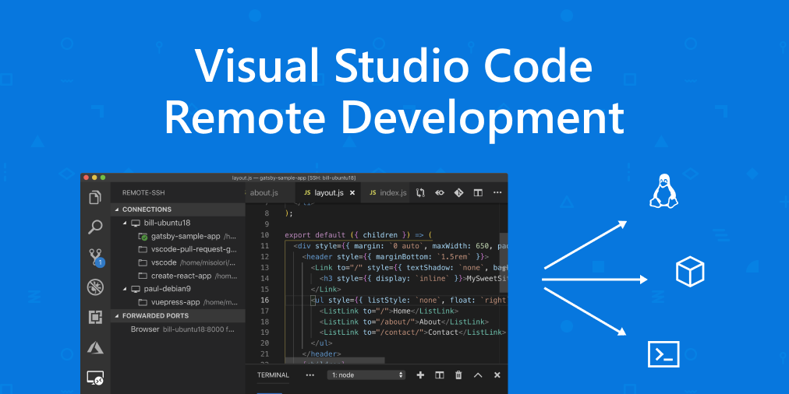

---
categories:
- Tech
date: "2019-06-13T23:07:55+08:00"
draft: false
image:
  caption: ""
  focal_point: ""
  preview_only: true
tags:
- vscode
- docker
title: Docker + VSCode + Windows搭建舒适开发环境
---

最近VSCode的稳定版本已经开始支持Remote Development，这让笔者看到了远程开发更多的可能性。Linux的图形界面一直让人不是很满意（等待Wayland时代的到来），RD的出现让笔者对使用Windows界面在远端Linux环境开发产生了兴趣。

<!--more--> 



## 前置工作

1. Windows操作系统，最好是Windows10
2. Docker环境
3. VSCode，最新稳定版即可，记得安装RD插件
4. [OpenSSH compatible SSH client](https://code.visualstudio.com/docs/remote/troubleshooting#_installing-a-supported-ssh-client)
5. 生成好你的ssh公私秘钥

## 构建Docker镜像

笔者比较偏好Archlinux，这里使用Archlinux为例构建镜像。

首先是Dockerfile：

```Dockerfile
FROM archlinux/base:latest
ENV TERM="xterm-256"
# 如果需要代理添加下两行
ENV http_proxy="http://proxy.com:80"
ENV https_proxy="http://proxy.com:80"
RUN ln -sf /usr/share/zoneinfo/Asia/Shanghai /etc/localtime \
    && echo "Server = https://mirrors.tuna.tsinghua.edu.cn/archlinux/\$repo/os/\$arch" > /etc/pacman.d/mirrorlist \
    && pacman -Syy \
    && pacman -S --needed --noconfirm \
    zsh which neovim curl sed awk openssh sudo git gcc make \
    # 如果你的容器运行在Linux上可以安装docker实现“Docker in Docker”，后面会详细介绍
    docker \
    # 笔者这里使用root用户连接
    && echo "PermitRootLogin yes" >> /etc/ssh/sshd_config \
    # 如果需要代理添加下行
    && echo "proxy=http://proxy.com:80" > /root/.curlrc \
    && mkdir /root/Workspace
EXPOSE 22
WORKDIR /root
CMD [ ! -f /etc/ssh/ssh_host_rsa_key ] && ssh-keygen -A; /bin/sshd -D
```

在Dockerfile所在路径下执行：

```sh
docker build -t archlinux:dev .
```

基本的镜像制作这里就大功告成了。

## 运行容器

执行下列命令：

```sh
docker run -d -v /your/path:/root/Workspace -p 50001:22 archlinux:dev
```

该命令使用守备方式拉起镜像，并将容器内的22端口映射到host的50001端口提供ssh连接。同时将/root/Workspace挂载到host上，以防重新构建开发环境时你的工作内容可以持久保存在host上。

之后可以通过exec进入容器安装你想要的工具。

## 连接容器

要想成功连接容器我们这里需要添加authorized_keys到容器内。

还记得之前生成的ssh公钥吗？把它的内容复制到/root/authorized_keys这个文件里。

或者你也可以使用一些命令进行授权登记：

```sh
ssh-copy-id -i ~/.ssh/id_rsa.pub root@remoteaddr -p 50001
```

但该命令需要你的root用户已经设置了密码。

之后在VSCode李配置你的ssh config：

```sh
# Read more about SSH config files: https://linux.die.net/man/5/ssh_config
Host your remote addr
    HostName your remote addr
    User root
    Port 5000
```

现在你就可以使用VSCode在远端开发了！

## Docker in Docker

由于现在很多项目对Docker的依赖越来越重，因此我们希望在容器中也能够使用Docker。

如果你的host是Linux并且Docker已经可以正常运行，这是可以很容易实现的，只需要在运行命令时添加一个挂在目录：

```sh
docker run --security-opt seccomp:unconfined --name arch --network host -d -v /your/path:/root/Workspace -v /var/run/docker.sock:/var/run/docker.sock -p 50001:22 archlinux:dev
```

如果你的容器运行在Windows环境下，就需要将挂载路径稍作修改：

```sh
docker run --security-opt seccomp:unconfined --name arch --network host -d -v /your/path:/root/Workspace -v //var/run/docker.sock:/var/run/docker.sock -p 50001:22 archlinux:dev
```

除了这种方式外，你也可以用一些技巧不需要外挂目录，在容器内使用“真正的Docker”。有兴趣的可以参考[dind](https://github.com/jpetazzo/dind)。
